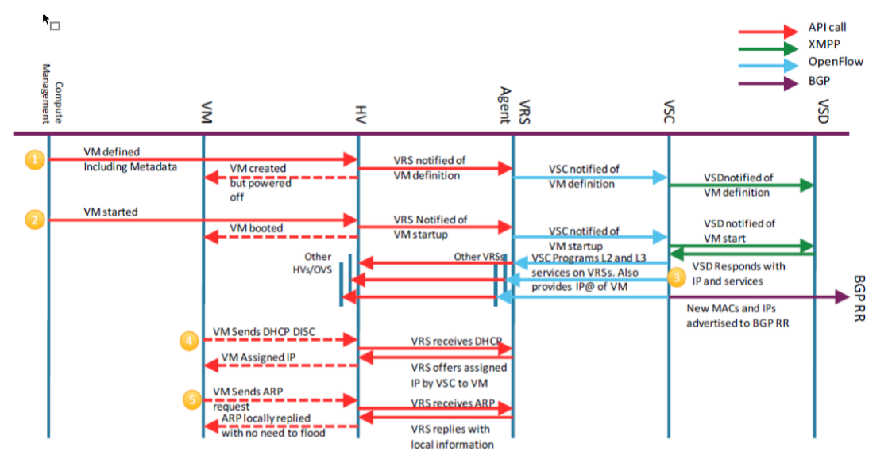

VSP Main Components

Nuage Networks VSP는 Data center network의 가상화와 생성과 동시에 컴퓨트 자원간의 자동적인 연결을 지원하는 SDN 솔루션이다.
Nuage VSP는 프로그램 가능 한 비지니스 로직과 강력한 정책 엔진을 통해 엄격함이 요구되는 대형 멀티 테넌트 데이터 센터들에게 개방적이고 반응성이 높은 SDN 솔루션을 제공한다 .
Nuage VSP는 기존 DC IP 네트워크 위에 배포될 수 있다.

- VSD (Virtualized Services Directory)

Nuage VSD는 프로그램 가능 한 정책 엔진이며 프로그램 가능 한 분석 엔진이다. 
Nuage VSD는 유연하고 계층적인 네트워크 정책 플랫폼을 제공하여 IT 관리자들로하여금 사용자 친화적으로 자원 정책을 정의하고 집행하게 한다.
Nuage VSD는 사용자, 컴퓨트, 네트워크 자원 등을 역할에 기반해 지원하는 멀티 테넌트 서비스 목록(multi-tenant service directory)을 포함하며
IP 주소나 ACL과 같은 네트워크 자원 할당을 지원한다.

Nuage VSD는 서비스 안정화를 위해서 수집 빈도, 이동평균 샘플등과 같은 TCA(Threshold Crossing Alerts) 정교한 통계 정책등을 정의하게 한다.
TCA가 이벤트를 발생시키면 generic messagin bus를 통해 외부 시스템으로 전달될 수 있다.
통계자료는 몇시간 혹은 며칠 몇 달 동안 모아져서 분석 클러스터에 저장되고 data minig과 퍼포먼스 리포딩을 가능하게 한다.

VSD Meditator는 VSD Architecture에서 최 하단에 위치하며 VSC 인스턴스와 정책 정보에 대한 질의를 받거나 단말의 상태값을 업데이트하고 정책이 수정되었을 때 그 정보를 VSC에 배포하는 등의 정보전달을 수행한다.

- VSD Statistics 

VSD는 VRS가 보내는 통계를 받아서 수집한다. 수집된 통계자료는 Nuage가 제공하는 이중화 혹은 삼중화 된 Elasticsearch DB에 저장된다. 
Elasticsearch API는 VSD 통계 엔진에 의해 데이터 분석과 정보 제공을 위해 사용된다

- VSC (Virtualized Servies Controller)

Nuage VSC는 강력한 SDN Controller로 테넌트 별 네트워크와 서비스 토폴로지를 조망하며 Data Center에 견고한 네트워크 제어부의 기능을 수행한다.
Nuage VRS같은 네트워크 전송부는 Openflow를 사용해 VSC를 통해서 virtual routing and switching 구조가 만들어진다. 
VSC는 VSD와 XMPP를 사용해 통신한다. jeabberd라는 XMPP server/cluster는 VSD와 VSC entity간에 메세지를 분산시키기 위해 사용된다
다수의 VSC 인스턴스들은 MP-BGP를 통해서 DC들과 상호 위임된다.
VSC는 Alcatel-Lucent의 SR OS (Service Router Operating System)을 기반으로 작동하고 VM environment에서 동작한다.

- VRS (Virtual Routing and Switching)

Nuage VRS는 네트워크 전송부를 구성하는 개선된 Open vSwitch다.
VSD가 정의한대로 L2-L4 트래픽 정책을 시행하며 사용자 트래픽을 인/디캡슐레이션 한다.
VRS는 VM를 추적하여 생성, 이동, 삭제 이벤트 등에 능동적으로 네트워크 연결 상태를 수정한다.

1. VM에 대한 정의를 하이퍼바이저에게 보냄 libvirt의 API call에 의해.
이 것으로 vm을 생성하고 VRS agent에게 보내면 vm에 대한 메타데이터를 Openflow를 통해 VSC에 보낸다.
VSC는 이 이벤트를 XMPP를 통해서 VSD에게 보냄

2. VM이 올라오면  HV을 통해서 VRS에게 API call을 보낸다. HV는 VRS에게 VM이 올라왔다고 알리고 
VRS는 다시 VSC에게 openflow를 사용해서 vm 정의에 있는 메타 데이터를 보낸다. VSC는 또 VSD에게 VM이 올라온 것을 알리면 VSD는 올라온 vm의 메타데이터를 룩업해서 vm이 요청된 도메인/존/네트워크에 연결되는 것이 적합한지 확인한다. 
이 후에 VSD는 VSC에게 요청에 상응하는 NS Param을 보낸다

3. VSC는 컨트롤 플레인에서 서비스에 대한 개괄적인 것들(L2, L3)을 만들고 IP를 VRS에게 보낸다.
