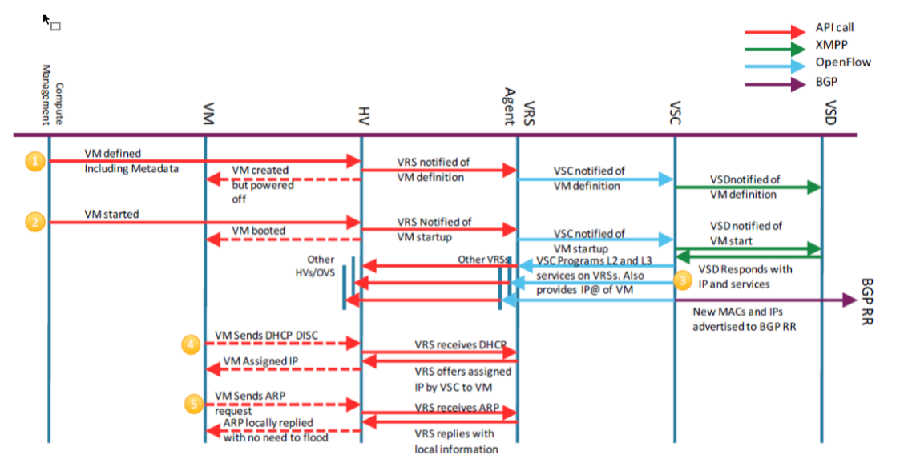

# 1. CBND
        Imagine that orchestration. (TED)	
        그 모든 것을 한데 어우러지게 만드는 과정을 말입니다. 
## 1.1. CBND란?
        CloudBand Network Director,
        NFV Orchestrator,
        ETSI NFV MANO GS에 정의된 대로 NFV Orchestrator의 기능을 제공.
## 1.2. CBND의 역할
        CBND는 VNF, Network Service 그리고 그에 상응하는 
        Virtual Netwrok 자원의 라이프사이클 관리를 자동화 한다.

        Nokia CBND는 ETSI NFV MANO에서 사전 정의 한 
        NFV Orchestrator의 모든 기능을 담고있다.
## 1.3.CBND가 제공하는 기능
        • Resource Orchestration (RO) function,
          Network Service Orchestration (NSO) function
        • Data center service chain Orchestration (SDN)
        • Network Service lifecycle management (deploy, monitor, terminate)
        • NSD Model: TOSCA
        • Support for multiple VNFMs (VNFM-G, VNFM-S)
        • Support for multiple VIMs
        • Network Service topology, monitoring and records
        • NS root cause analysis and alerts
	    • RESTful open interfaces for efficient multi-vendor Telco cloud management
-------------

# 2. CBAM        
## 2.1. CBAM이란? 
        CloudBand Application Manager,
        ETSI phase2를 따르는 generic VNF Manager (VNFM-G)
## 2.2. CBAM의 역할 
- standards-based API를 통한 VIM, NFVO와 상호작용
- VNF instance의 라이프 사이클 관리
(instantiate, commssion, scale and terminate)
- 확장된 기능
(healing, patching, backup and restore)

## 2.3. CBAM이 제공하는 기능
• VNF Operation automates
• VNF scales in/out
• VIM Resource monitors
• Ready to use

------------

# 3. CBIS
## 3.1. CBIS란?
        CloudBand Infrastructure Software,        

## 3.2. CBIS의 역할
- VNF를 활성화 하고 실행하기 위해서 컴퓨트, 스토리지 네트워크 자원들을 가상화 하고 관리하는 역할을 한다.
- CBIS는 VIM기능을 수행하고 각 서버에 설치된 가상화 소프트웨어 (하이퍼바이져, 가상 스위치, 모니터링)을 제공한다.
- CBIS는 서버간의 스토리지 자원을 가상화 하고 외부 스토리지 어레이를 지원한다. 
- CBIS는 인프라에 대해 확장된 분석과 모니터링 기능을 제공하고 이벤트와 알람을 제공한다. 
- CBIS는 VIM과 NFVI의 역할을 모두 수행한다.

## 3.3. CBIS 구성요소
CBIS는 크게 두 가지로 구성된다.
- Undercloud Server
- Overcloud

Overcloud는 아래와 같은 노드들을 가지고 있다.
- Controller nodes
- Compute Nodes
- Storage Nodes or External Storage

Undercloud Server는 CBIS 클러스터에서 따로 독립된 서버에서 운영되며 
CBIS 클러스터의 라이프 사이클을 관리한다.

### 3.3.1. Undercloud는 크게 두 가지로 구성된다.

- 3.3.1.1 Undercloud Server

    - UnderCloud는 독립된 전용 물리서버에서 CBIS OPENSTACK 클러스터를 지원한다.
    이 서버는 RHEL/KVM의 OS/Hypervisor와 server OS 위에 설치된 Undercloud VM으로 구성된다.
    - 이 서버는 각 노드를 관리하기 위해 추가적인 app을 호스팅 할 수 있다. 
- 3.3.1.2 Undercloud VM

    - CBIS의 Undercloud 소프트웨어가 바로 Undercloud Server위에서 실행되는 VM이다. 
    - UnderCloud의 주 목적은 Overcloud servers의 설치와 유지 관리에 있다.
    - 여기서 설치는 customized configuration file에 기반하고 이 파일은 각 서버의 역할 기능 등에 대한 정보가 담겨있다. 
    - 추가로 Undercloud는 compute 추가/삭제, 복원 업그레이드 패치와 같은 Overcloud 운용 기능을 수행한다.

### 3.3.2. Overcloud Nodes

- Controller Node

    - CBIS 클러스터를 관리하는 소프트웨어를 실행한다. 
    - CBIS노드들은 보통 3개의 관리용 서버로 구성된다.(HA 요구사항에 의해) 
    - Controller node의 핵심적인 역할은 인프라를 관리하는 OPENSTACK controller를 호스팅 하는 역할이다.
    - OPENSTACK 컨트롤러들은 Active-Active 모드로 운영되고 scalability와 HA때문에 로드 밸런싱을 사용한다.

- Compute Node
    - Compute node들은 가상화 된 요소들이 운영되는 실질적인 플랫폼이다. 이 자원들은 OPENSTACK에 의해 관리된다.
    - 각 컴퓨트 노드는 가상화된 인프라의 하이퍼바이저로써 Linux KVM을, 네트워킹을 위한 Virtual Switch로써 OVS를 운용합니다. 
        S
    - DN에서 OVS는 Nuage로부터 VRS로 치환되었다. 
    - Compute node들은 Ceph를 통하거나 직접 Storage를 다룬다.
    - Compute node에는 OPENSTACK이나 ZABBIX와 같이 Controller node에 있는 service들과 상호작용하기 위한 agent들을 포함한다. 

- Storage Node
    - CBIS 클러스터의 Storage는 두 가지 방법으로 실행될 수 있다.

        - Hyperconverged storage

            이 모드에서는 전용된 스토리지 노드가 있지 않고 각 compute node server가 storage 노드로 사용되고 그 HDD들은 
            distributed storage system의 공용 HDD가 된다.
        - Storage nodes

            이 모드에서는 클러스터에서 많은 HDD를 가지고 있는 전용 노드들이 compute node들에게 공용 저장소를 제공하도록 사용된다
            HDD들은 Ceph 분산 저장 시스템에 의해 관리된다. 각 storage node들은 Ceph를 기반으로 한다.

    - OSD (Ceph Object Storage Daemons)는 자동화된 데이터 복제기능과 밸런싱같은 기능들을 제공한다.
    VNF data는 구성 옵션에 따라 2, 3개의 OSD에 복제되고 항상 다른 compute에 위치하게된다.
    
    
## 3.4. CBIS는 멀티 테넌트를 지원한다.
- CBIS는 3단계의 tenant separation을 지원한다.
    - Networking isolation
        - Tenant Networks, VxLAN 기반
            - OPENSTACK의 인터날 네트워크로 underlying infrastructure에 대한 지식이 요구되지 않는다.
        - Provider networks (VLAN)
            - 허용된 VLAN ID를 통해 외부와의 통신을 허용한다.

    - User isolation
        - 각 고객을 각각의 유저로 구분 프로젝트별로 각기 설정이 가능하다.

    - Storage separation
        - 각 고객별로 서로 각각의 저장 공간을 할당받는다.

## 3.5. OPENSTACK Key Components
- (CBIS Software Components)
    - nova
        Virtual Machines 배포, 관리
        오픈스택 컴퓨트로도 알려진 nova는 IaaS(Infrastructure as a service) 클라우드 컴퓨팅 플랫폼을 제어한다.
        Nova는 Virtual Macines의 네트워크를 대비하고 관리함으로서 컴퓨트 자원에 대한 on-demand access를 제공한다.
        Amazon의 EC2, Rackspace의 Cloud Servers와 유사한 형태로.
        Nova 자체는 어떠한 가상화 소프트웨어도 포함하지 않고 있다. 다만 Web API를 통해 host OS위에서 돌아가는 underlying virtualization mechanism을 제공하고 기능을 드러낸다.(?)
    - swift
        오픈스택 스토리지 서비스 중 하나. swift-proxy, account, container, object로 구성되며 account, container는 db로 데이터가 관리되고 Object는 저장공간에 직접 저장되는 방식으로 되어있다. swift-proxy는 오픈스택의 object API를 제공한다 사용자는 이 object API를 통해 데이터를 save or load 할 수 있다. 
    - cinder
        오픈스택 스토리지 서비스 중 하나. 스위프트와 달리 블럭 스토리지로 블럭 스토리지 장치를 guest instance에 제공하는 역할을 한다. 한 마디로 vm에 영구적인 스토리지를 제공한다고 할 수 있다. cinder는 cinder-API cinder-Volume cinder-scheduler daemon cinder-backup daemon message queue로 구성된다
    - neutron
        사용자가 정의한 네트워크와 부착물에 대한 API를 제공한다. 많은 유명한 네트워킹 벤더와 기술들을 지원하기 위한 플러그인 아키텍쳐를 가진다.
        Nuage가 뉴트론의 플러그인들 중 하나이다.
    - horizon
        인스턴스를 작동하고, IP주소를 할당, 접속제어 구성과 같은 오픈스택 서비스와 상호 작용하는 웹 기반 셀프 서비스 포털을 제공한다. 한 마디로. GUI
    - keystone
        다른 오픈스택 서비스에 대한 인증과 권한 부여 서비스를 제공한다. 모든 오픈스택 서비스에 대한 endpoint의 카탈로그를 제공한다.
    - glance
        가상 머신 디스크 이미지를 저장하고 검색한다. 오픈스택 컴퓨트는 인스턴스를 제공하는 동안 만들어 사용한다.
    - ceilometer 
        오픈스택 클라우드 사용량을 측정한다.
    - aodh
        telemetry alarming service 원격측정 알람 서비스. 수집된 수치값 혹은 정의된 규칙이 깨졌다는 이벤트를 받았을 떄 알람을 울려준다.
    - heat
        오픈스택 오케스트레이션 서비스. 오픈스택은 오케스트레이션에 HOT(Heat Orchestration Template)을 사용한다.

- Controller Nodes
    - Pacemaker
        Pacemaker는 오픈소스 클러스터 자원 관리자이다. (CRM. Cluster Resource Manager)
        각 노드와 리소스 레벨 고장의 감지와 회복을 통해 클러스터 서비스들을 고 가용 상태로 만들어준다.
        페이스 메이커는 클러스터의 행동을 제어한다. 
        페이스페이커는 액티브 컨트롤러 노드를 서출하고 각각의 서비스에 하나의 인터페이스를 제공한다. 
    - HAProxy
        (High Availability Proxy)는 유명한 오픈소스 소프트웨어로 리눅스 솔라리스 FreeBSD에서 사용 가능 한 TCP/HTTP 로드 밸런싱과 프록싱 솔루션이다. 가장 일반적인 사용예는 다수의 서버들에 부하를 분산시켜주는 것이다.
        로드밸런싱을 위한 HAProxy 스케쥴링 알고리즘에는 다양한 옵션들이 있지만 CBIS에서는 RR을 사용한다.
        페이스메이커는 어떤 HAProxy가 Active 상태인지를 구분한다.
    - Vitrage
        RCA(Root Cause Analysis) 오픈스택 알람과 이벤트들을 취합, 분석 확장하는 서비스로
        직접적으로 감지되기 전에 문제의 근본 원인으로 여겨지는 것을 찾아내고 줄여준다.
    - ELK 
        Elasticsearch, Logstash and Kibana 오슨 소스 스택은 그 확장성, 성능, 편리함 덕에 많이 쓰이는 logging platform이다. Logstash는 소스별로 로그를 수집하고  분석한다. Elasticsearch는 수집한 로그에 대한 데이터베이스가 되고 Kibana는 GUI라고 보면 된다. 
    - Zabbix 
        monitoring service 
    - Redis

    - In Memory Data Store Key-value 데이터 저장소 

- Undercloud openstack components
    - Ironic
        Nova Baremetal driver에서 분리돼 나온 프로그램으로 물리 서버를 지원하는 역할을 한다. 
        Ironic은 PXE, IPMI와 같은 일반적인 기술의 reference driver를 제공한다.
    - TripleO
        Openstack On the Openstack 
        오픈스택 클라우드 설치와 업그레이드 작동에 초점을 맞추고 있는 오픈스택

        

            CBIS controllers는 CBIS cluster operation에서 중요한 역할을 수행한다.
            CBIS 클러스터를 관리하는 소프트웨어를 실행한다.
            CBIS노드들은 보통 3개의 관리용 서버로 구성된다.(HA 요구사항에 의해)
            Controller node의 핵심적인 역할은 인프라를 관리하는 OPENSTACK controller를 호스팅 하는 역할이다.
            OPENSTACK 컨트롤러들은 Active-Active 모드로 운영되고 scalability와 HA때문에 로드 밸런싱을 사용한다.

## 3.6. CBIS generci Networking Reference Architecture

    - CBIS Physical Network
        IPMI - Undercloud 서버가 다른 모든 서버들에 접속할 수 있게 해준다.
        Provisioning - Undercloud의 제어부. 배포와 관리용. 
        Tenant network - VMs internal traffic
        External network - 호라이즌 대시보드와 OPENSTACK API
        Storage network - 컴퓨트/컨트롤러 노드에서 스토리지의 자원에 접근.
        Storage management - Ceph back-end 서비스와 각 스토리지 간 자료 복제

    - Logical networks
        Tenant VLANs
        Provider VLANs
        Floating IP VLANs
        SR-IOV VLANs

## 3.7. CBIS 네트워킹의 핵심은 쪼개기

- mgmt traffic과 tenant traffic을 나눔으로 보안을 높힌다.
- internal traffic - provisioning network, internal API, Storage, Storage mgmt
- external traffic - Provider VLANs, tenant VXLANs CBIS external VLAN
- *CBIS with Nuage - provider network와 tenant networks가 같은 VLAN을 공유

## 3.8. Virtualization

        가상화는 기본적으로 KVM, QEMU, Libvirt를 기반으로 한다. 하이퍼바이저는 vm을 만들도록 도와주는 에이전트이다. 하이퍼바이저는 vm을 만들고 운영하며 host의 자원을 vm에 제공한다.
        KVM은 QEMU가 각기 다른 아키텍쳐의 하드웨어 가상화 기능에 접근하는 것을 도와준다. 그리고 QEMU 프로세스에 가속화 기능도 제공한다. QEMU는 하이퍼바이저 KVM은 Accelerating agent가 된다.

- QEMU

    Quick Emulator. guest os가 돌아갈 수 있는 하드웨어를 만들어 주는 소프트웨어.
    모든 가상화 하드웨어는 QEMU 컨피그에 따라 코드로 만들어진다.
    호스트 위에 만들어진 각각의 가상 머신은 QEMU 인스턴스를 가지고, 각각의 게스트는 QEMU 프로세스의 일부로 동작한다. 

- KVM

    Kernel-based Virtual Machine. 은 리눅스 커널에 하드웨어 가상화 기능을 활성화 하는 커널 모듈이다. 이 코드들은 리눅스 커널을 하이퍼 바이저로 만들어준다. 

- Libvirt

    virtualization management library. KVM과 QEMU를 관리한다.
    API library, daemon, CLI tool로 구성된다.

## 3.9. Availability zones

    컴퓨트 노드들 간의 논리적인 그룹으로 사용 목적에 맞게 구분하여 사용이 가능하게 해준다.

## 3.10. HA(High Availability)
        CBIS는 teleco grade product로 디자인되었다. 따라서 모든 면에서 full HA를 지원하는 게 요구된다.
        HA는 각기 다른 레벨에서 : power, hardware, network, storage and software.

- power 
- Networking 

    물리 인터페이스의 각 쌍은 a/s 로 동작하게 되어있다. 각각의 인터페이스가 서로 다른 스위치에 연결되어있다면. switches는 a/a로 동작하거나 하나의 장비로 동작(?)
- compute nodes

    컴퓨트 노드들은 로드 쉐어링 모드로 동작하고 한 노드가 죽을 경우 죽은 노드를 교체함으로서 복구할 수 있다. (?)
- storage nodes 

    스토리지 노드들은 Ceph를 기반으로 하며 OSDs은 무한한 확장성을 가진다.
    VNF 데이타는 2개 혹은 3개의 OSDs에 복제되며 각각은 항상 다른 노드에 위치한다.
    각 컨트롤러 노드에는 OSD monitor가 있고 이 것들은 항상 Ceph cluster의 상태를 모니터링한다.

- controller nodes

    HA 구성을 위해 3개. 1개가 끊어질 경우를 대비해서
    각 컨트롤러 노드에는 같은 OPENSTACK 컴포넌트와 HAProxy, Zabbix, ELK, Redis가 설치되어있다. 대부분의 서비스들은 a/a로 동작하고 몇몇은 a/s로 동작한다.

    - pacemaker clustering
        pacemaker는 어는 서버가 연결되어있고 어느 서버가 끊어졌는지 찾는다
        active 하나를 선출하기 위해서.
        각각의 서비스에 하나의 인터페이스를 제공, 페이스메이커는 외부 사용자에게 virtual ip를 제공한다. 
    - HAProxy Load Balancer
        각각 서비스들의 실행중인 인스턴스들을 통틀어 유저로부터 받은 트래픽을 lb하는 역할을 한다. 항상 ACTIVE인 하나의 HAProxy가 존재하고 페이스메이커는 어느 HAProxy가 active인지 구분한다. active HAProxy는 모든 VIP와 연동되어있고 모든 클러스터된 서비스들 가운데 RR방식으로 트래픽을 분산한다.

    HA 구성을 위해 서비스들의 타입을 기반으로 유지?한다.

    - stateless Services
        노바, 글랜스 키스톤과 같은 멀티 마스터 로 동작하는 서비스들에 대해서는 HAProxy가 트래픽을 고르게 분산시킨다. 만약 하나의 서비스가 패일이 나면 HAProxy가 알고 그 쪽으로는 더 이상 트래픽을 보내지 않는다. 헬스체크는 1초에 한 번씩 함.
    - Stateful Services 
        stateful 서비스들은 session consistency를 위해 DB 복제가 필요하다 
        MariaDB, Galera cluster(DB Solution) and RabbitMQ (OS AMQP messaging)
        마리아디비와 래빗엠큐는 A/S모드로 동작하고 active instance는 페이스메이커에 의해 선출된다. (이 경우엔 트래픽이 HAProxy를 통해 가지 않는다.)
            
# 4. Nuage Networks VSP Main Components

Nuage Networks VSP는 Data center network의 가상화와 생성과 동시에 컴퓨트 자원간의 자동적인 연결을 지원하는 SDN 솔루션이다.
Nuage VSP는 프로그램 가능 한 비지니스 로직과 강력한 정책 엔진을 통해 엄격함이 요구되는 대형 멀티 테넌트 데이터 센터들 (DCs)에게 개방적이고 반응성이 높은 SDN 솔루션을 제공한다.
Nuage VSP는 기존 DC IP 네트워크 위에 배포될 수 있다.

---------------------

## 4.1 VSD (Virtualized Services Directory)

- Nuage VSD는 프로그램 가능 한 정책 엔진이며 프로그램 가능 한 분석 엔진이다. 

- Nuage VSD는 유연하고 계층적인 네트워크 정책 플랫폼을 제공하여 IT 관리자들로하여금 사용자 친화적으로 자원 정책을 정의하고 집행하게 한다.

- Nuage VSD는 사용자, 컴퓨트, 네트워크 자원 등을 역할에 기반해 지원하는 멀티 테넌트 서비스 목록(multi-tenant service directory)을 포함하며 IP 주소나 ACL과 같은 네트워크 자원 할당을 지원한다.

- Nuage VSD는 서비스 안정화를 위해서 수집 빈도, 이동평균 샘플등과 같은 TCA(Threshold Crossing Alerts) 정교한 통계 정책등을 정의하게 한다.

- TCA가 이벤트를 발생시키면 generic messagin bus를 통해 외부 시스템으로 전달될 수 있다.

- 통계자료는 몇시간 혹은 며칠 몇 달 동안 모아져서 분석 클러스터에 저장되고 data minig과 퍼포먼스 리포딩을 가능하게 한다.

- VSD Meditator는 VSD Architecture에서 최 하단에 위치하며 VSC 인스턴스와 정책 정보에 대한 질의를 받거나 단말의 상태값을 업데이트하고 정책이 수정되었을 때 그 정보를 VSC에 배포하는 등의 정보전달을 수행한다.

---------------------

## 4.2 VSD Statistics 

- VSD는 VRS가 보내는 통계를 받아서 수집한다. 수집된 통계자료는 Nuage가 제공하는 이중화 혹은 삼중화 된 Elasticsearch DB에 저장된다. 

- Elasticsearch API는 VSD 통계 엔진에 의해 데이터 분석과 정보 제공을 위해 사용된다

---------------------

## 4.3. VSC (Virtualized Servies Controller)

- Nuage VSC는 강력한 SDN Controller로 테넌트 별 네트워크와 서비스 토폴로지를 조망하며 Data Center에 견고한 네트워크 제어부의 기능을 수행한다.
- Nuage VRS같은 네트워크 전송부는 Openflow를 사용해 VSC를 통해서 virtual routing and switching 구조가 만들어진다. 
- VSC는 VSD와 XMPP를 사용해 통신한다. jeabberd라는 XMPP server/cluster는 VSD와 VSC entity간에 메세지를 분산시키기 위해 사용된다
- 다수의 VSC 인스턴스들은 MP-BGP를 통해서 DC들과 상호 위임된다.
- VSC는 Alcatel-Lucent의 SR OS (Service Router Operating System)을 기반으로 작동하고 VM environment에서 동작한다.

---------------------

## 4.4. VRS (Virtual Routing and Switching)

- Nuage VRS는 네트워크 전송부를 구성하는 개선된 Open vSwitch다.
- VSD가 정의한대로 L2-L4 트래픽 정책을 시행하며 사용자 트래픽을 인/디캡슐레이션 한다.
- VRS는 VM를 추적하여 생성, 이동, 삭제 이벤트 등에 능동적으로 네트워크 연결 상태를 수정한다.

---------------------

## 4.5. Nuage Networks Workflow
1. VM에 대한 정의를 하이퍼바이저에게 보냄 libvirt의 API call에 의해.
이 것으로 vm을 생성하고 VRS agent에게 보내면 vm에 대한 메타데이터를 Openflow를 통해 VSC에 보낸다.
VSC는 이 이벤트를 XMPP를 통해서 VSD에게 보냄

2. VM이 올라오면  HV을 통해서 VRS에게 API call을 보낸다. HV는 VRS에게 VM이 올라왔다고 알리고 
VRS는 다시 VSC에게 openflow를 사용해서 vm 정의에 있는 메타 데이터를 보낸다. VSC는 또 VSD에게 VM이 올라온 것을 알리면 VSD는 올라온 vm의 메타데이터를 룩업해서 vm이 요청된 도메인/존/네트워크에 연결되는 것이 적합한지 확인한다. 
이 후에 VSD는 VSC에게 요청에 상응하는 NS Param을 보낸다

3. VSC는 컨트롤 플레인에서 서비스에 대한 개괄적인 것들(L2, L3)을 만들고 IP를 VRS에게 보낸다.
